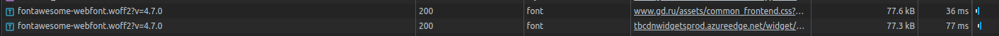

# Тулинг, ч.2

## 1. Network:

Отчет хранится в файле https://drive.google.com/file/d/1yz3weii-QNZy6P09SjKNEA_pl5aUmRpf/view?usp=sharing

### Дублирование ресурсов:

Для решения я отсортировал запросы по величине занимаемого ответом места. По моей логике, два одинаковых файла помимо схожего имени должны иметь схожий вес. При этом добавлялись только GET-запросы с одинаковым ответом, POST игнорировались (при различных запросах они, вероятнее всего, отправляли разную информацию).

Вкратце: при всём уважении к прогрессивному дизайну, я нашел множество запросов со схожими данными, здесь самые крупные и очевидные из них:

### Лишний размер ресурса:

Для поиска запросов, занимающих излишнее место, я обращал внимание на минифицирование HTML/CSS/JS файлов. Как выяснилось, на удивление, почти везде соблюдается выравнивание, код достаточно понятен, что в случае скорости загрузки и объёма совсем не хорошо. Здесь несколько скринов с такими запросами:

В качестве бонуса прикладываю картинку, которая на сайте имеет размер 80*80px. Таким образом, на получение картинки по сети затрачивается ~в 4 раза больше ресурсов, чем нужно:

### Медленно загружающиеся ресурсы:

В числе медленно загружающихся ресурсов были небольшие аватарки и один внешний скрипт:

### Ресурсы, блокирующие загрузку:

Среди всех остальных, был скрипт, подключающий комментарии ВК к сайту, который загружался в то время, когда большая часть ждущих своей очереди запросов простаивала примерно 400мс:

### Что-то ещё:

Заметно, что значительная часть ресурсов уходит на загрузку картинок. При этом ресурсы, выделяемые на них, слишком велики. Вот, например, пример одной из самых больших картинок, которые вполне можно заменить стилями и легкими SVG изображениями:

## 2. Performance

Отчет хранится в файле https://drive.google.com/file/d/11KPbB0W6GD5nSXiYhw5SZMaU8p4EsFLk/view?usp=sharing

### Время от начала навигации до событий

Страница начала обновляться через **345мс** после начала измерений. Спустя **751мс** после начала измерений произошли события **"First Paint" и "First Contentful Paint"**. Через **1,37с** произошло событие **"DOM Content Loaded"**, через **1,67** - **"Largest Contentful Paint"**, через **31,68с** - **"Loaded"**. Таким образом, после начала обновления они происходили в таком порядке:
1. 406мс: **"First Paint" и "First Contentful Paint"**
2. 1025мс: **"DOM Content Loaded"**
3. 1325мс: **"Largest Contentful Paint"**
4. 31335мc: **Loaded**

### Где LCP???

Загрузка LCP происходит на этом DOM-элементе:

. 

Там просто чёрная картинка.

### Сколько времени на что тратится

Здесь:

## 3. Coverage

### Скрин вкладки

Вот он!

### Объем неиспользованного CSS

Согласно данным Coverage: **560Кб**

### Объем неиспользованного JS

Согласно данным Coverage: **2355Кб**

## 
# Прошу не расходиться! Есть еще вторая часть!

## 1. Network

Отчет хранится в https://drive.google.com/file/d/12Mu25RjC2PK6yifYR6reWadnU8jUXiTz/view?usp=sharing

### Дублирование ресурсов:

Количество дублирований сократилось, вот то, что удалось найти (одинаковые картинки)

### Лишний размер ресурса:

Не удалось найти, кроме изображений ничего не подключается, они сами хорошо сжаты

### Медленно загружающиеся ресурсы:

Несколько изображений загрузилось позже остальных, в основном из-за того, что запросу приходилось ожидать своей очереди среди остальных:

### Ресурсы, блокирующие загрузку:

Как можно заметить по скрину, загрузка одних изображений тормозит загрузку других:

### Что-то ещё:

Несмотря на уменьшение возможностей устройства, почти все картинки загружаются как прежде без изменений

## 2. Performance

Отчет хранится в https://drive.google.com/file/d/1hzGZiTyN-CEnp1GiElQbI6UfnDPgjsNA/view?usp=sharing

### Время от начала навигации до событий

После начала обновления страницы события происходили в таком порядке:
1. 8981мс: **"First Paint" и "First Contentful Paint"**
2. 39530мс: **"DOM Content Loaded"**
4. 60353мc: **Loaded**

Спустя несколько попыток выяснилось, что **"Largest Contentful Paint"** не будет, в Яндекс Браузере она отображается через 8940 мс, но и порядок таймингов там совершенно другой

### Где LCP???

Без изменений (согласно Яндекс Браузеру) загрузка LCP происходит на этом DOM-элементе:

.

Там просто чёрная картинка.

### Сколько времени на что тратится

Здесь:

## 3. Coverage

### Скрин вкладки

Пожалуйста:

### Объем неиспользованного CSS

Согласно данным Coverage: **558Кб**

### Объем неиспользованного JS

Согласно данным Coverage: **2355Кб**

(почти ровно столько же, сколько без ограничений)

